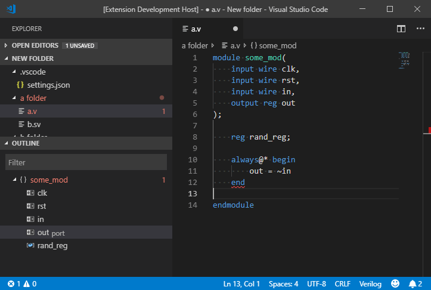

# vscode-system-verilog

SystemVerilog support for VS Code with Syntax Highlighting, Snippets, Linting, Formatting, and hover/definitions

[](https://marketplace.visualstudio.com/items?itemName=AndrewNolte.vscode-system-verilog)
[](https://marketplace.visualstudio.com/items?itemName=AndrewNolte.vscode-system-verilog)



## Installation

Install it from the [VS Code Marketplace](https://marketplace.visualstudio.com/items/AndrewNolte.vscode-system-verilog)

## Linters
  The extension will make symlinks to all sv files in .sv_cahce/files, and then pass that to tools with the -y flag so they can discover modules without the need for individual build configs. This can be disabled with `verilog.index.enableSymlinks`

  Multiple Linters can be used in parallel.
### [Slang](https://github.com/MikePopoloski/slang) - `slang` (recommended)
 


### [Icarus](https://github.com/steveicarus/iverilog) - `iverilog`
 


### [Verilator](https://github.com/verilator/verilator) - `verilator`
 


### [Modelsim](https://eda.sw.siemens.com/en-US/ic/modelsim/) - `modelsim`
### [Vivado Logical Simulation](https://www.xilinx.com/products/design-tools/vivado.html) - `xvlog` 

## Formatters

### [verible](https://github.com/chipsalliance/verible) - `verible-verilog-format` (recommended)
 


### [verilog-format](https://github.com/ericsonj/verilog-format) - `verilog-format`
 

### [istyle](https://github.com/thomasrussellmurphy/istyle-verilog-formatter) - `verilog-format` 
 


## Language Servers

###  Built-in language server
- Document symbols outline
- Hover and definitions across files, including macros
- Code completion for modules on "ModuleName #"
- Code completion suggests relevant symbols- package refs, params, ports, macros, builtins, etc.
- Relies on modules matching the name of the file
- Hover and Completion for builtin functions like $bits()

### [verible-verilog-ls](https://github.com/chipsalliance/verible?label=verible-verilog-ls)
 


### [veridian](https://github.com/vivekmalneedi/veridian)
 


### [rust_hdl](https://github.com/VHDL-LS/rust_hdl)
 


### [svls](https://github.com/dalance/svls)
 


### [hdl_checker](https://github.com/suoto/hdl_checker)
 


## Recommended SystemVerilog Configuration

### Install [universal-ctags](https://github.com/universal-ctags/ctags)

This is used for definition support, hover support, and most of the analysis features.

Use 6.1 or later for port/param definition support

- Windows - Release are [here](https://github.com/universal-ctags/ctags-win32/releases)
- Linux - Releases are [here](https://github.com/universal-ctags/ctags/releases/)
- macOS - Install through Homebrew: ```brew install universal-ctags```

### Install [slang](https://github.com/MikePopoloski/slang)


This is the recommended linter because it's the [fastest and most compliant](https://github.com/MikePopoloski/slang?tab=readme-ov-file#:~:text=slang%20is%20the%20fastest%20and%20most%20compliant%20SystemVerilog%20frontend%20(according%20to%20the%20open%20source%20chipsalliance%20test%20suite).) language frontend, and it has very precise error messages.

### Example Configuration

```json
// these get passed to linters and other tools with -I, or the correct format for that tool
"verilog.includes": [
    "hdl/lib",
    "hdl/includes"
],
"verilog.ctags.path": "/usr/local/bin/ctags-universal",
"verilog.lint.slang.enabled": true,
// includes and '-y .sv_cache/files' are already passed to linters
"verilog.lint.slang.args": "--error-limit 200",
"verilog.lint.slang.path": "/usr/local/bin/slang",
// multiple linters can run concurrently
"verilog.lint.verilator.enabled": true,
// tools will use the default name on the path if not given
"verilog.format.svFormatter": "verible-verilog-format",
"verilog.format.verible.args": "--flagfile=myflags.txt",
"verilog.format.verible.path": "/usr/local/bin/verible-verilog-format",
// select directories to format on save
"verilog.formatDirs": [
    "hdl/my/project/with/formatting"
],
```

Explore all configuration options [here](CONFIG.md)

For debugging your config, you can see the logs in Output tab > select 'verilog' in the dropdown


## Why this extension?

This was forked from https://github.com/mshr-h/vscode-verilog-hdl-support because I wanted to move faster with shipping features and refine the focus on system verilog and large monorepos.

Since forking, these features have been added:
- Indexing
  - in memory index for ModuleName.sv -> path/to/ModuleName.sv
  - symlink file index in .sv_cache/files
  - indexes .svh files to pick up macros
  - works on the assumption that ModuleName.sv contains ModuleName
- Definition Provider
  - port/params definitions
  - Interface.var definitions
  - InterfaceArray[x].var definitions
  - greatly improved hover/definition performance
- Linters
  - ability to run multiple linters
  - fixed verilator lint
  - Passes -y .sv_cache/files for tools 
  - more precise slang and verilator lint ranges
- autocomplete module/interface while typing - 'Module #(' will trigger completion
- format on save for directories specified in config
- simplified configuration

There's a lot more planned as well:
- expanded hover support for hierarchical references (ctags needs a fix)
- slang language server
- expand macros on hover + expansion command
- project or top level selection
  - instance selection within project
  - context aware inlay hints for elaboration

