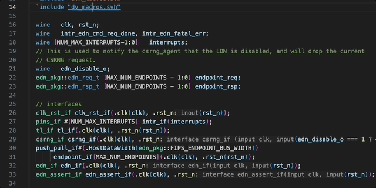

# Verilog/SystemVerilog Tools

Verilog and SystemVerilog support including linting from popular tools, completions, formatting, and project level analysis.

Install it from the [VS Code Marketplace](https://marketplace.visualstudio.com/items/AndrewNolte.vscode-system-verilog) or [OpenVSX](https://open-vsx.org/extension/AndrewNolte/vscode-system-verilog)

<!--
[](https://marketplace.visualstudio.com/items?itemName=AndrewNolte.vscode-system-verilog)
[](https://marketplace.visualstudio.com/items?itemName=AndrewNolte.vscode-system-verilog) -->


## Linters
### [`slang`](https://github.com/MikePopoloski/slang) (recommended) || [`iverilog`](https://github.com/steveicarus/iverilog) (Icarus) || [`verilator`](https://github.com/verilator/verilator) ||  [`modelsim`](https://eda.sw.siemens.com/en-US/ic/modelsim/) || [`xvlog`](https://www.xilinx.com/products/design-tools/vivado.html) (Xilinx/Vivado) || [`xrun`](https://www.cadence.com/en_US/home/tools/system-design-and-verification/simulation-and-testbench-verification/xcelium-simulator.html) (Cadence/Xcelium)

  The extension leverages the "-y" flag found on most tools, pointing it to a symlink index of the repo. This makes for almost zero per-project config when modules match each file name. A command titled `Verilog: Fix filenames...` is offered to help with refactoring these to match.
  
  Note for windows users: "Developer Mode" needs to be turned on in order to create symlinks.

  Multiple linters are able to run in parallel:


## Language Server

Snappy Hover/Goto Definition on nearly every symbol, including in other files. Optional inlay hints for ports.



Compeltions- Modules, Params/Ports, Macros, Package references, SV builtins, etc.


Set top level, which shows the hierarchy, different modules used, project level linting, and soon to be waveform integration.

<!-- {: width="50%" height="auto"}
 -->
 


### See a detailed feature list and roadmap in [FEATURES.md](FEATURES.md)

#### Third party language server options: [`verible-verilog-ls`](https://github.com/chipsalliance/verible/tree/master/verilog/tools/ls) || [`veridian`](https://github.com/vivekmalneedi/veridian) || [`svls`](https://github.com/dalance/svls)

## Formatters

### [`verible-verilog-format`](https://github.com/chipsalliance/verible/tree/master/verilog/formatting) (recommended) || [`verilog-format`](https://github.com/ericsonj/verilog-format) || [`istyle`](https://github.com/thomasrussellmurphy/istyle-verilog-formatter)


Verible supports both SystemVerilog and Verilog, while the others are only verilog. `verilog.formatDirs` lets you specify directories that you want to be formatted.

<br>


# Recommended Configuration

### Install [universal-ctags](https://github.com/universal-ctags/ctags)

This is used for definition support, hover support, and most of the analysis features. Use 6.1 or later for port/param definition support

- Windows - Release are [here](https://github.com/universal-ctags/ctags-win32/releases)
- Linux - Releases are [here](https://github.com/universal-ctags/ctags/releases/)
- macOS - Install through Homebrew: ```brew install universal-ctags```

### Install [slang](https://github.com/MikePopoloski/slang)


This is the recommended linter because it's the [fastest and most compliant](https://github.com/MikePopoloski/slang?tab=readme-ov-file#:~:text=slang%20is%20the%20fastest%20and%20most%20compliant%20SystemVerilog%20frontend%20(according%20to%20the%20open%20source%20chipsalliance%20test%20suite).) language frontend, and it has so many more useful warnings than other tools.

### Example Configuration

```json
// these get passed to linters and other tools with -I, or the correct format for that tool
"verilog.includes": [
    "hdl/lib",
    "hdl/includes"
],
"verilog.ctags.path": "/usr/local/bin/ctags-universal",
"verilog.lint.slang.enabled": true,
// includes and '-y .sv_cache/files' are already passed to linters
"verilog.lint.slang.args": "--error-limit 200",
"verilog.lint.slang.path": "/usr/local/bin/slang",
// multiple linters can run concurrently
// you can specify if some can only run at the project level
"verilog.lint.verilator.projectEnabled": true,
// tools will use the default name on the path if not given
"verilog.svFormat.formatter": "verible-verilog-format",
"verilog.svFormat.verible.args": "--flagfile=myflags.txt",
"verilog.svFormat.verible.path": "/usr/local/bin/verible-verilog-format",
// select directories to format on save
"verilog.formatDirs": [
    "hdl/my/project/with/formatting"
],
```

### See all config options in [CONFIG.md](CONFIG.md) 

For debugging your config, you can see the logs in Output tab > select 'verilog' in the dropdown

### Contributions are welcome, see [DEVELOPING.md](DEVELOPING.md)
